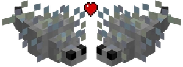
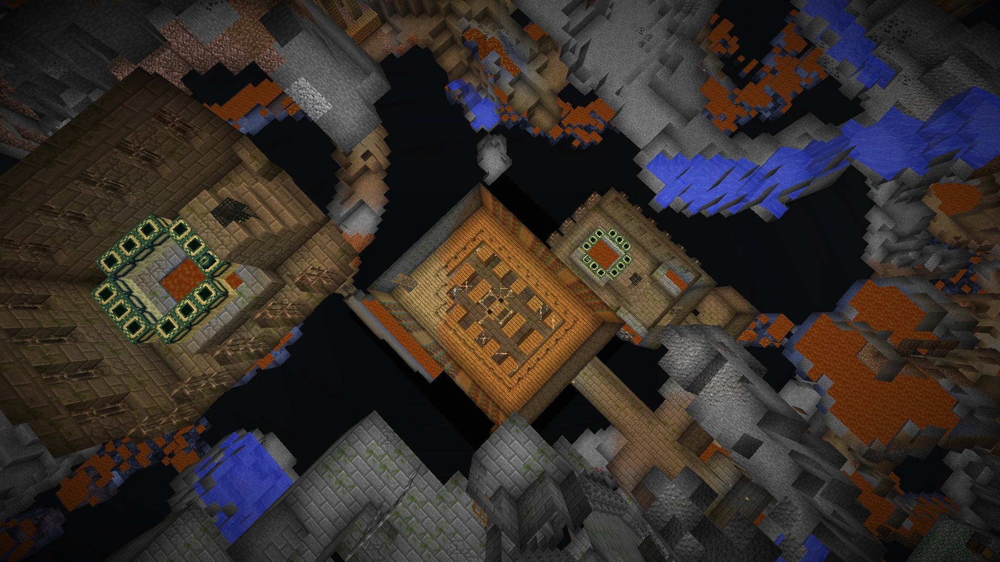

<div align="center">
  
  <h1>[WIP] Поиск двойных спавнеров чешуйниц</h1>
</div>

## Консольное C++-приложение для поиска сидов Minecraft Java Edition с двумя спавнерами чешуйниц

[](https://github.com/KK-mp4/double-silverfish-spawner-finder/blob/master/README.md)
[](https://github.com/KK-mp4/double-silverfish-spawner-finder/blob/master/README.ru.md)
[](https://deepwiki.com/KK-mp4/double-silverfish-spawner-finder)

## Введение

У меня есть [концепт карьера на чешуйницах](https://youtu.be/gz_HdqsPPS4), который оставляет после себя только руды и другие виды камня. Работы ещё много, но уже ясно, что мне нужен способ быстро создавать слой высотой в 1 блок из заражённого камня с помощью [4 gt укладчика пола от glowsquid](https://youtu.be/aA4V4Ws8_ig). Поэтому я хочу найти два расположенных рядом спавнера чешуйниц для двойной скорости.

> [!NOTE]
> Вклад в репозиторий приветствуется. Подробнее - на странице [development guide](https://github.com/KK-mp4/double-silverfish-spawner-finder?tab=contributing-ov-file).

## Генерация крепостей

Спавнеры чешуйниц [появились](https://minecraft.wiki/w/Silverfish#History) в Minecraft Java Edition 1.0.0 и генерируются только в портальных комнатах крепостей. Крепости генерируются кольцами. В `1.0.0 – 1.8.9` кольцо одно, а в `1.9+` их уже девять. После выбора координат игра ищет подходящий биом в пределах +/-112 блоков:

```java
// Псевдокод StrongholdStructure.java
private Biome[] validBiomes = new Biome[]{DESERT, FOREST, EXTREME_HILLS, SWAMPLAND, TAIGA, ICE_PLAINS, ICE_MOUNTAINS, DESERT_HILLS, FOREST_HILLS, EXTREME_HILLS_EDGE, JUNGLE, JUNGLE_HILLS};
```

Когда найдено валидное место, структура начинает собираться по частям.

## Поиск сидов

Для симуляции биомов Minecraft используется библиотека [cubiomes](https://github.com/Cubitect/cubiomes). Этого хватает, чтобы определить, где начнёт генерироваться крепость, но чтобы узнать точную позицию спавнера чешуйниц (портальной комнаты), нужно полностью повторять логику генерации самой крепости. Так что это достаточная оценка, но требует ручной фильтрации, чтобы находить места, где два спавнера действительно активируются одним игроком.

> [!TIP]
> Для просмотра старых сидов Minecraft советую использовать [Amidst](https://github.com/toolbox4minecraft/amidst), [Cubiomes Viewer](https://github.com/Cubitect/cubiomes-viewer) или [Minemap](https://github.com/hube12/Minemap).

## Результаты

### Поиск в пределах одной версии

Изначально я рассчитывал, что случайные смещения крепостей (+/-112 блоков) при поиске биома могут иногда давать две крепости достаточно близко друг к другу. Не делая настоящей математики, я просто написал сид-файндер и выяснил, что получить близкое расположение не удаётся. Вот лучший найденный сид:

| Сид | Примерная дистанция, блоки | Версия | X1 | Z1 | X2 | Z2
|-|-|-|-|-|-|-
| 7510906 | 812.86 | 1.5.1 | 4 | -524 | 484 | 132

В версиях после увеличения числа крепостей до 128 расстояния становятся ещё больше.

### Поиск между версиями

Чтобы найти двойной спавнер, пришлось мыслить шире. Генерация крепостей и мира сильно менялась от версии к версии. Идея была в том, чтобы найти сид, где генерация крепостей в разных версиях сдвигает портальные комнаты так, что они оказываются рядом, но не в одном чанке. Тогда можно сгенерировать один спавнер в одной версии, затем обновиться и сгенерировать второй.

Сначала я взял две версии, где число крепостей выросло с 3 до 128: `1.8.9` и `1.9`. Почти сразу крепости начали попадаться в ~50 блоках друг от друга.

Потом я попробовал версии, где менялась генерация мира: `1.6.4` и `1.7`, и тут успех. Крепости пытаются появиться в одном месте "по дизайну", но изменения биомной карты смещают их на небольшие расстояния. В итоге стали встречаться пары крепостей менее чем в 32 блоках практически в каждом сидe.

Так как у меня не было точного определения позиции портальной комнаты, пришлось вручную фильтровать такие сиды, и примерно через десяток попыток я нашёл расположение, где портальные комнаты достаточно близко для двойного спавнера:

| Сид | Примерная дистанция, блоки | Версия 1 | X1 | Z1 | Версия 2 | X2 | Z2
|-|-|-|-|-|-|-|-
| 382397 | 16 | 1.6.4 | 980 | 244 | 1.8.9 | 980 | 228

<p align="center">
  
</p>

Фактически, при дальнейшем улучшении сид-файндера (точный расчёт позиций спавнеров и перебор всех версий, где менялась генерация мира или крепостей) вполне реально получить до 9 спавнеров в зоне досягаемости одного игрока. Технически предел - количество чанков, способных породить спавнер в радиусе активации одного игрока.

> [!TIP]
> Если ввести сид 0 в поле сида, Minecraft сгенерирует случайный сид. Чтобы получить настоящий сид 0, как объяснил Panda4994 в видео «*[Seeds & Generation #01: Ways to Enter a Seed](https://youtu.be/OLS7CCgNcuY)*», нужно ввести что-то вроде `PDFYFCD`, как советует инструмент [seedinfo](https://panda4994.github.io/seedinfo/seedinfo.html#0).

Если хотите глубже разобраться в сид-поиске, посмотрите репозиторий [fnseedc](https://github.com/SeedFinding/fnseedc).

## Настройка в [VSCode](https://code.visualstudio.com/)

Если вы используете другую IDE, вы, скорее всего, и так знаете, что делаете, и можете собрать C++ проект сами. Ниже - простой вариант настройки.

В проекте есть файл [`.vscode/extensions.json`](https://github.com/KK-mp4/double-silverfish-spawner-finder/blob/main/.vscode/extensions.json). После открытия проекта VSCode покажет уведомление «Хотите установить рекомендованные расширения?». Нажмите «Да».

Дальше нажмите «Left Control + Shift + P», откройте панель быстрых команд и найдите «CMake: Configure». Затем просканируйте доступные kits, и если их нет — поставьте любой C++ компилятор. После этого проект можно собрать и запустить.

## Контрибьюторы

<a href="https://github.com/KK-mp4/double-silverfish-spawner-finder/graphs/contributors">
  
</a>

## [Лицензия](https://github.com/KK-mp4/double-silverfish-spawner-finder/blob/master/LICENSE.md)

Эта программа распространяется по лицензии MIT. Пожалуйста, прочитайте файл License, чтобы узнать условия использования.
